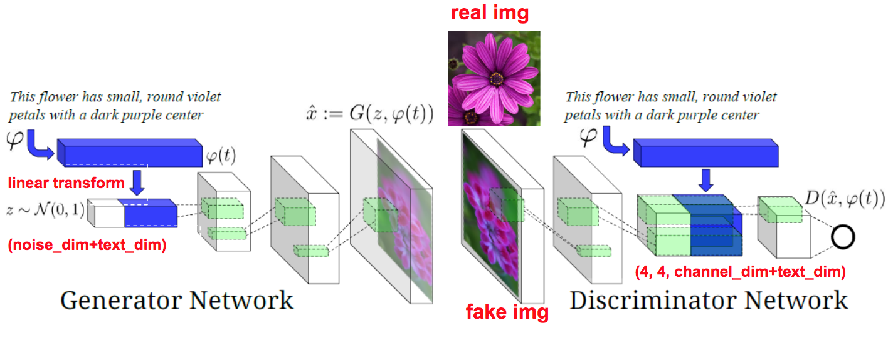

This a Condition GAN model based on Basic GAN, WGAN, LSGAN to generate Japan Anime from text description.

## Data ##
The data is collected by En Yu Fan who collected the data from the following website:
http://konachan.net/post/show/239400/aikatsu-clouds-flowers-hikami_sumire-hiten_goane_r

## Model ##
We adapted the following model proposed in [Generative Adversarial Text to Image Synethesis](https://arxiv.org/pdf/1605.05396.pdf). The model architecture is showed in the following figure

Model:

## Input ##
the input should be [hair color] hair [eyes color] eyes. Our model can suppose generate the corresponding Japan Anime.

## Output Examples ##
red hair red eyes:

purple hair blue eyes:

## Running the Program ##
bash run.sh [testing_text.txt]

## Discussion ##
We wrote our results and discussion in report.pdf which is written in Chinese.

